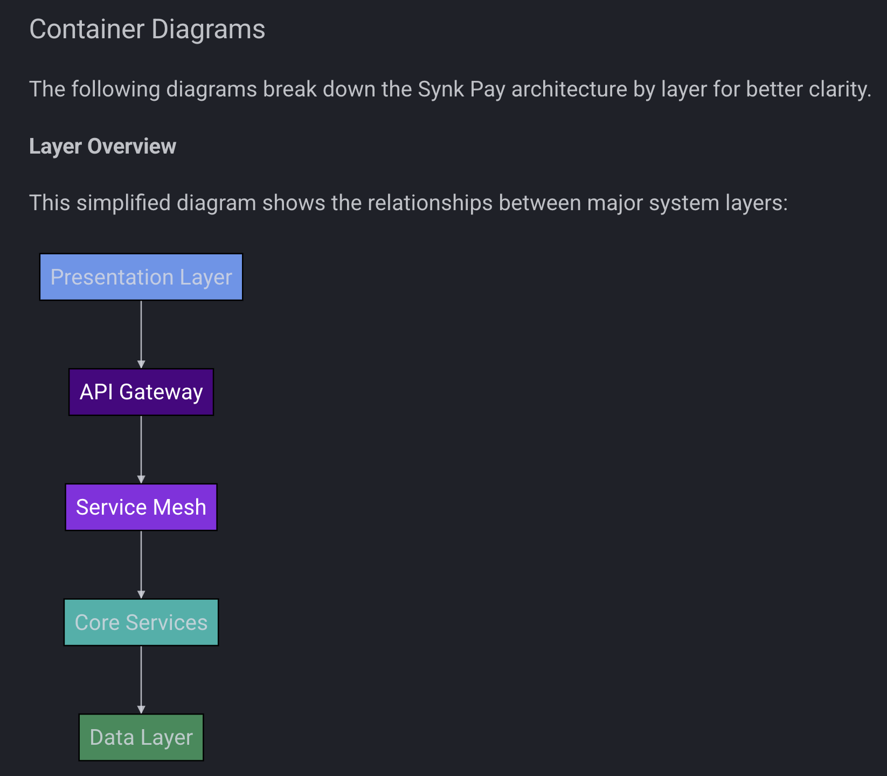

# SynkPay API Gateway

A lightweight API gateway built with [NestJS](https://nestjs.com/) to orchestrate and manage HTTP traffic between multiple microservices. It acts as a centralized entry point, integrating authentication, proxy routing, and third-party services like SDK.finance. It exposes a single GraphQL endpoint for client interactions.

---

## 🚀 Tech Stack

- **Framework:** NestJS
- **API Type:** GraphQL
- **Authentication:** JWT
- **Rate Limiting:** Throttler (GraphQL-compatible)
- **Logging:** Winston
- **Cache & Token Store:** Redis
- **Deployment:** Docker
- **Third-Party Integration:** [SDK.finance](https://sdk.finance/)
- **Upcoming Features:** KrakenD

---

## 📁 Project Structure

```
.
├── src
│   ├── common/
│   │   └── sdk-finance/
│   │   └── redis/
│   │   └── errors/
│   ├── config/
│   ├── graphql/
│   ├── health/
│   ├── microservices/
│   ├── logging/
│   └── rate-limit/
├── test/
├── docs/
│ └── architecture/
├── .env.example
├── README.md
├── package.json
├── tsconfig.json
├── tsconfig.build.json
├── nest-cli.json
├── eslint.config.mjs
├── yarn.lock
```

> **Note:** Microservices are managed outside this repository.

---

## 🧪 Running Locally

Install dependencies:

```bash
yarn install
```

Start the server in development mode:

```bash
yarn start:dev
```

Start the server in production mode:

```bash
yarn start:prod
```

---

## 🐳 Docker

Build and run the container:

```bash
docker build -t synkpay-api-gateway .
docker run -p 3000:3000 synkpay-api-gateway
```

---

## 🧪 Testing

Run unit tests:

```bash
yarn test
```

Run end-to-end tests:

```bash
yarn test:e2e
```

Generate test coverage:

```bash
yarn test:cov
```

---

## 📦 Environment Variables

The application relies on the following environment variables. See .env.example for a working template.

```env.example
| Variable                  | Description                                       |
| ------------------------- | ------------------------------------------------- |
| `PORT`                    | Port used by the app                              |
| `NODE_ENV`                | Environment mode (e.g., development, production)  |
| `API_KEY`                 | Internal secret key for secured operations        |
| `RATE_LIMIT_GLOBAL`       | Max requests per window for rate limiting         |
| `RATE_LIMIT_WINDOW_MS`    | Window duration in milliseconds for rate limiting |
| `JWT_PUBLIC_KEY_DEV`      | Dev public key for JWT (ask TL)                   |
| `JWT_PRIVATE_KEY_PROD`    | Prod private key for JWT (ask TL)                 |
| `JWT_PUBLIC_KEY_PROD`     | Prod public key for JWT (ask TL)                  |
| `REDIS_HOST`              | Redis hostname                                    |
| `REDIS_PORT`              | Redis port                                        |
| `ENABLE_HTTPS`            | Enable/disable HTTPS for environments                                       |
| `CORS_ORIGIN`             | CORS origin                                      |
| `LOG_LEVEL`               | Log level (info, error, debug, etc.)              |
| `LOG_TO_CONSOLE`          | Enable/disable console logs                       |
| `LOG_TO_FILE`             | Enable/disable log file writing                   |
| `LOG_FILE_PATH`           | Path to log file if enabled                       |

```
---

## 🧭 Architecture Overview

The following diagrams illustrate the API Gateway's role within the Synk Pay ecosystem.





---

### 🔐 Security Features

This API Gateway includes built-in security layers:

- **CORS configuration** to restrict origin access.
- **Helmet integration** for setting secure HTTP headers.
- **HTTPS support** with self-signed certificates for local development.
- **Request validation middleware** that blocks large payloads, suspicious patterns, and disallowed headers.
- **Header sanitization middleware** to remove or override potentially insecure response headers.

Unit tests are included for critical middleware. Run them with:

```bash
yarn test src/security/__tests__/request-validator.middleware.spec.ts
```

## 🚦 Rate Limiting

Rate limiting is implemented using a custom `GqlThrottlerGuard` based on NestJS's `@nestjs/throttler` package. It protects GraphQL endpoints from abuse by limiting the number of requests per user/IP within a configured time window.

🔧 Configuration:

Limits are defined globally via environment variables using default values until the final real values are available:

```env.example
RATE_LIMIT_GLOBAL=100           # Max requests per window
RATE_LIMIT_WINDOW_MS=60000      # Window duration in milliseconds

```
These values are injected using ThrottlerModule.forRootAsync() inside AppModule.

⚙️ How It Works

- **IP-based throttling with GraphQL context support via GqlExecutionContext.**
- **Can override defaults via @Throttle() on resolvers.**
- **Returns HTTP 429 on limit exceeded.**

---

### ✅ Rate Limiting Unit Tests

| Component            | Test File                    | Description                                                                |
|----------------------|------------------------------|----------------------------------------------------------------------------|
| `GqlThrottlerGuard`  | `rate-limit.guard.spec.ts`   | Tests GraphQL context extraction, IP-based tracking, and rate limit logic  |
| `@Throttle` Decorator| `rate-limit.guard.spec.ts`   | Validates that metadata for `limit` and `ttl` is correctly attached        |

---

## 📚 Logging & Error Management

---

### 📦 Structured Logging & Monitoring

LoggerService -> A reusable and injectable service wrapping Winston, configured via `ConfigService`. Outputs fully structured JSON logs supporting:

- `correlationId`, `userId`, `operationName`, `operationType`
- `type`: distinguishes between `"request"` and `"event"`
- Log levels: `info`, `warn`, `error`, `debug`, `event`

Logging behavior is controlled by environment variables (via `ConfigService`): default values ​​defined in the .env.example.

#### 🧩 Middleware: CorrelationIdMiddleware

- Registers a unique `correlationId` per request.
- Sets x-correlation-id header in responses

#### 🧩 GraphQL Logging Interceptor

Registered globally via `APP_INTERCEPTOR`. Logs:
- Operation name and type
- Duration
- `correlationId` and `userId`
- Error trace if applicable

#### 🔁 HttpLoggerService (Outbound Requests)

Custom wrapper over `HttpService`. Used for microservice communication.

- Automatically injects `correlationId` and `userId` into headers
- Logs method, URL, status, duration or errors
- Used instead of direct `httpService.request(...)` calls

---

### ✅ Logger Unit Tests

| Component                  | Test File                               | Description                                                                |
|----------------------------|-----------------------------------------|----------------------------------------------------------------------------|
| `LoggerService`            | `logger.service.spec.ts`                | Verifies that log messages are correctly formatted, structured, and routed |
| `HttpLoggerService`        | `http-logger.service.spec.ts`           | Ensures outbound HTTP logs include metadata like correlationId and errors  |
| `GraphQLLoggingInterceptor`| `graphql-logging.interceptor.spec.ts`   | Tests that GraphQL operations are intercepted and logged with context info |

---

### ❗ Centralized Error Management

Purpose -> Improve control and visibility over runtime errors across the API Gateway.

#### 🧱 `CustomGraphQLError`

Custom class extending `GraphQLError` with:
- `extensions.code`: numeric code
- `extensions.success`: boolean
- `extensions.timestamp`: included if `includeTimestamp = true`

Used for consistent error output structure across all GraphQL layers.

#### ⚙️ `formatGraphQLError`

Registered in `GraphQLModule` to normalize all outgoing error responses. Ensures that:
- All GraphQL errors follow the same shape
- Only safe fields are exposed to clients

---

## 🧩 Artifact-Producing Modules

The following modules generate outputs relevant for auditing, monitoring, and compliance:

| Module                    | Purpose                         | Output Format   | Path                                 |
| ------------------------- | ------------------------------- | --------------- | ------------------------------------ |
| `LoggerService`           | Structured app logging          | JSON logs       | `src/logging/logger.service.ts`      |
| `CorrelationIdMiddleware` | Unique ID per request           | Header + log    | `src/logging/middleware/`            |
| `HttpLoggerService`       | Logs external service calls     | JSON logs       | `src/logging/http-logger.service.ts` |
| `GqlThrottlerGuard`       | Rate limiting protection        | 429 + log entry | `src/rate-limit/`                    |
| `CustomGraphQLError`      | Normalized GraphQL error output | JSON error      | `src/errors/`                        |


Output logs are stored in console or file (depending on env vars) and support centralized logging (e.g., ELK, CloudWatch).

---

## 🧰 Module Documentation Checklist

Use this checklist when documenting new modules in the API Gateway:

 Describe purpose and functionality

 Document inputs/outputs (headers, logs, etc.)

 Specify location in codebase

 Reference compliance relevance (if applicable)

 Include example usage or config (optional)

✅ Current implemented module: Authentication

Stores users, roles, and permissions.

Designed to persist data in PostgreSQL.

DB integration is pending, but schema and logic are in place for role-based access control.

---

## 📜 Compliance Mapping

This section maps key regulatory requirements to their implementation status within the Synk Pay platform.

| Standard / Regulation     | Requirement                     | Status (SDK / Gateway)  | Implementation Summary                           |
|---------------------------|---------------------------------|-------------------------|--------------------------------------------------|
| **MiCA**                  | Fund Segregation                | ✅ Supported (SDK)      | Double-entry ledger for client fund isolation    |
| **AMLD6 / MiCA**          | 24h AML Monitoring              | ⚠️ Partial (SDK)        | Synk Pay must integrate Chainalysis KYT          |
| **DORA**                  | Incident Reporting (< 4h)       | ❌ Not Covered          | Needs alert pipeline (e.g. PagerDuty)            |
| **DORA TLPT**             | Penetration Testing             | ❌ Not Covered          | External red teaming required                    |
| **NIS2 / ISO 27001**      | Operational Resilience          | ⚠️ Partial              | Gateway + infra: mTLS, WAF, segmentation         |
| **PSD2 / SCA**            | Strong Auth (2FA/WebAuthn)      | ✅ Supported (2FA only) | Keycloak-based auth; WebAuthn optional           |
| **GDPR**                  | EU Data Residency + ARCO        | ✅ Supported            | Data hosted in EU; ARCO handled by app layer     |
| **WCAG / EN301549**       | Accessibility Compliance        | ❌ Not Covered          | Frontend must ensure accessibility               |
| **OWASP SAMM / CIS**      | Secure SDLC                     | ⚠️ Partial              | Logging, testing, linting in Gateway             |
| **Vendor Risk (DORA)**    | SLA & Contingency Management    | ⚠️ Partial              | Requires SLA enforcement and escrow options      |
| **Business Continuity**   | Disaster Recovery / DR          | ⚠️ Partial              | Multi-region setup pending                       |
| **MiCA Art. 71**          | Ledger Integrity                | ✅ Supported (SDK)      | Double-entry with auditability; hashing optional |
| **MiCA**                  | Immutable Logs                  | ❌ Not Native           | Use S3 WORM storage for logs                     |
| **ENISA**                 | Key Management (HSM)            | ❌ Not Native           | HSM integration pending (CloudHSM recommended)   |
| **BoL / XBRL**            | Regulatory Reporting            | ❌ Not Covered          | Custom reports needed using SDK exports          |
| **ISO 37002**             | Whistleblower Channel           | ❌ Not Covered          | Requires external secure channel                 |


> 💡 This mapping is maintained as part of Synk Pay’s commitment to regulatory readiness. While SDK.finance covers many structural requirements, operational compliance (e.g., logging, authentication, incident response) is implemented and extended at the API Gateway and infrastructure levels.

---

## 📬 Contact

- Maintainer: [Novatide Labs](https://github.com/aialphanovatide)
- Email: team@novatidelabs.com

---
